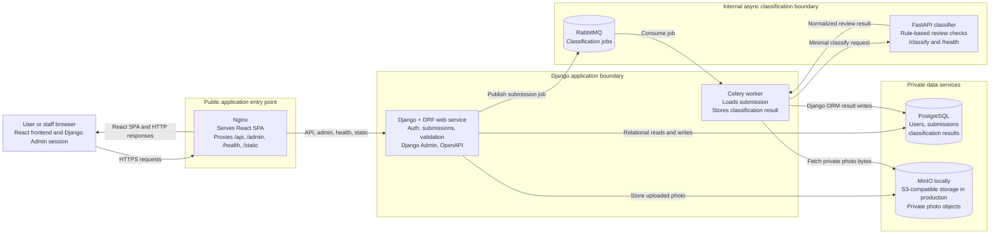

# Architecture Diagram

This diagram reflects the current Photo Classification Platform implementation.
The public path terminates at Nginx. Nginx serves the React frontend and proxies
backend traffic to Django. Classification remains internal and asynchronous.

## Boundary Notes

- Browser clients call only the public Nginx entry point.
- Django owns users, permissions, submissions, admin review, database writes,
  upload orchestration, and job publishing.
- The Celery worker runs the asynchronous classification workflow using Django
  models, private object storage, RabbitMQ, and the internal classifier.
- The FastAPI classifier is stateless and rule-based in the current take-home
  implementation. It does not own auth, persistence, or object storage access.
- PostgreSQL stores structured records. MinIO/S3-compatible object storage stores
  uploaded photo bytes privately.
