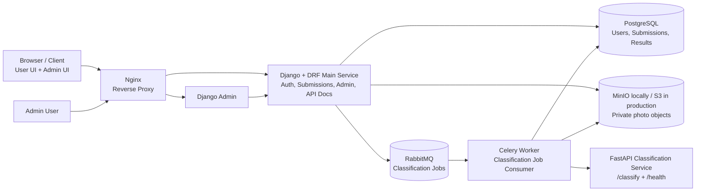

# Architecture: Photo Classification Platform

## Architecture Overview

This platform is a cloud-deployable photo submission and classification system. Users can register, log in, upload a photo, submit profile metadata, and receive a classification result. Admin users can review, filter, and search submitted records.

The architecture intentionally uses two application microservices:

1. **Django + Django REST Framework main service**

   * Owns authentication, users, submissions, metadata validation, storage orchestration, admin access, and database writes.
2. **FastAPI classification service**

   * Owns classification logic behind a small stateless API.

Supporting infrastructure includes PostgreSQL, MinIO/S3-compatible object storage, RabbitMQ, Celery workers, and Nginx.

This design satisfies the assessment requirement for at least two microservices without adding unnecessary services that would make the system harder to build, test, and explain.

## High-Level Goals

The main goals are:

* Provide a working user flow for registration, login, photo upload, metadata submission, and classification.
* Provide an admin panel for searching, filtering, and inspecting submissions.
* Keep the system cloud-deployable using Docker and Kubernetes-friendly components.
* Separate classification logic from the main application service.
* Store structured data in PostgreSQL and binary photo objects in object storage.
* Make classification asynchronous and retryable through RabbitMQ and Celery.
* Keep the implementation practical for a take-home assessment and defensible in a technical interview.

## Assumptions and Scope

This architecture makes the following assumptions:

- The assessment requires a working classification result, but does not require a production ML model.

- The default classifier is rule-based and classifies submission validity/review state, not the person in the photo.

- Django Admin is acceptable as the admin panel because the requirement is filtering, searching, and retrieving submitted records.

- MinIO is used locally as an S3-compatible object storage implementation; production can use S3 or another compatible provider.

- The first version prioritizes a clear, testable, cloud-deployable architecture over advanced ML, custom admin UI, or complex distributed ownership.

## Architecture Diagram

The current system diagram is maintained as a standalone deliverable in
[architecture-diagram.md](architecture-diagram.md). It reflects the implemented
React + Nginx public entry point, Django application boundary, asynchronous
RabbitMQ/Celery workflow, internal rule-based FastAPI classifier, PostgreSQL,
and private object storage.

## Component Responsibilities

### Browser / Client

The browser runs the React user frontend served by Nginx and reaches Django
Admin through the same public application entry point for staff review.

For this assessment, the admin interface is Django Admin rather than a custom admin frontend. This keeps the scope focused on backend architecture, data modeling, filtering, classification, and deployment.

### Nginx

Nginx is the public web entry point. It serves the built React frontend and
proxies backend routes to the Django service.

Responsibilities:

* Serve the React single-page application.
* Proxy `/api/`, `/admin/`, `/health`, and `/static/` routes to Django/DRF.
* Provide a production-like entry point locally and in deployment.
* Allow static/media routing configuration if needed.
* Keep internal services such as PostgreSQL, RabbitMQ, MinIO, Celery, and the classifier private.

### Django + Django REST Framework Main Service

The Django service is the main application service.

Responsibilities:

* User registration and login.
* Authentication and authorization.
* Submission creation.
* Metadata validation.
* Upload orchestration.
* Writing submission records to PostgreSQL.
* Uploading photos to MinIO/S3-compatible storage.
* Publishing classification jobs to RabbitMQ.
* Exposing API documentation through OpenAPI, for example with DRF Spectacular.
* Providing Django Admin as the admin panel.
* Enforcing admin-only access to review workflows.

Django is the right place for these responsibilities because they are application and data ownership concerns. Authentication, permissions, validation, persistence, and admin review all depend on the same core domain model.

### PostgreSQL

PostgreSQL stores relational application data.

Responsibilities:

* Users and authentication-related records.
* Submission metadata.
* Classification result fields.
* Submission status.
* Timestamps such as created, updated, and classified time.
* Audit-friendly structured data.

PostgreSQL is used because the platform needs relational filtering, indexing, constraints, migrations, and reliable transactional writes.

### MinIO Locally / S3-Compatible Storage in Production

Object storage stores uploaded photo files.

Responsibilities:

* Store uploaded image objects.
* Use private object keys instead of permanent public URLs.
* Keep binary data out of PostgreSQL.
* Support a local development environment through MinIO.
* Allow production deployment to S3 or another S3-compatible provider.

The database stores object references, not the photo bytes themselves.

### RabbitMQ

RabbitMQ is the message broker for classification jobs.

Responsibilities:

* Decouple request handling from classification processing.
* Buffer jobs when workers are busy.
* Support retries and failure handling.
* Allow the classifier and worker to scale independently from the main web service.

### Celery Worker

The Celery worker executes asynchronous classification jobs.

Responsibilities:

* Consume classification jobs from RabbitMQ.
* Fetch the photo from object storage using internal credentials.
* Send image bytes and minimal technical metadata to the FastAPI classifier.
* Receive a normalized classification response.
* Save classification results using the Django application layer/ORM.
* Update submission status.
* Handle retryable failures.

The worker belongs close to the Django application code because it updates the same domain model and uses the same database schema.

### FastAPI Classification Service

The classification service is a separate stateless microservice.

Responsibilities:

* Expose `/classify`.
* Expose `/health`.
* Implement rule-based classification by default.
* Optionally support a future model-provider classifier behind the same API.
* Return a normalized classification response.

The classifier does not own authentication, database writes, object storage access, or admin behavior. It receives image bytes from the worker and returns a classification result.

## Service Boundaries

The system has two application service boundaries:

### Main Application Boundary: Django/DRF

Django owns the core product workflow:

* Users.
* Auth.
* Submissions.
* Metadata.
* Admin review.
* Database writes.
* Object storage orchestration.
* Job publishing.

This keeps domain ownership centralized. There is one service responsible for deciding who can create, view, update, and review submission records.

### Classification Boundary: FastAPI

FastAPI owns only classification logic.

It does not know about user accounts, admin permissions, or persistence. This makes the classification service simple, stateless, independently testable, and replaceable.

This boundary is useful because classification logic may evolve separately from the main application. For example, rule-based checks can later be replaced or extended by an ML model provider without changing the main submission workflow.

## Data Ownership

The Django service owns the application data model.

PostgreSQL contains:

* Users.
* Submissions.
* Metadata fields.
* Photo object keys.
* Classification categories.
* Review decisions.
* Status fields.
* Timestamps.

Object storage contains:

* Uploaded photo objects.

The FastAPI classifier does not own persistent data. It receives input, calculates a result, and returns that result to the worker.

This avoids split ownership of the database and keeps migrations, indexing, and data integrity straightforward.

## Communication Flow

The main communication paths are:

1. Browser communicates with Nginx over HTTP/HTTPS.
2. Nginx serves the React frontend and forwards backend routes to Django/DRF.
3. Django reads and writes structured data in PostgreSQL.
4. Django uploads photos to MinIO/S3-compatible object storage.
5. Django publishes classification jobs to RabbitMQ.
6. Celery consumes jobs from RabbitMQ.
7. Celery fetches photo bytes from object storage.
8. Celery calls the FastAPI classifier over an internal network.
9. Celery saves the result using the Django ORM.
10. Admin users inspect the result in Django Admin.

External clients do not call RabbitMQ, PostgreSQL, MinIO, Celery, or the classifier directly.

## Upload and Classification Flow

The upload and classification flow is asynchronous.

1. The user submits metadata and a photo through the frontend.
2. Nginx forwards the request to Django/DRF.
3. Django authenticates the user.
4. Django validates the metadata.
5. Django uploads the photo to MinIO/S3-compatible object storage.
6. Django creates a submission record in PostgreSQL with status `pending_classification`.
7. Django publishes a classification job to RabbitMQ.
8. The Celery worker consumes the job.
9. The Celery worker fetches the photo from object storage.
10. The Celery worker sends image bytes and minimal technical metadata to FastAPI `/classify`.
11. The FastAPI classifier performs rule-based classification or optional model-provider classification.
12. FastAPI returns a normalized classification result.
13. The Celery worker saves the classification result using the Django ORM.
14. The Celery worker updates the submission status.
15. The admin can view and filter the submission in Django Admin.

This keeps upload requests responsive and prevents the user-facing API from being blocked by classification work.

## Admin Review Flow

Django Admin is used as the admin panel for this assessment.

Admins can:

* List submissions.
* Filter by age.
* Filter by gender.
* Filter by place of living.
* Filter by country of origin.
* Filter by classification category.
* Filter by review decision.
* Search submitted records.
* View metadata.
* View photo reference/object key.
* View timestamps.
* View the latest classification result.

Django Admin is sufficient for this assessment because:

* It is protected by Django authentication and permissions.
* It supports list views, filters, search fields, and detail pages.
* It is fast to build and easy to demonstrate.
* It avoids unnecessary custom frontend complexity.
* It clearly satisfies the requirement for an admin panel that can filter, search, and retrieve submitted records.

A custom admin frontend could be added later if the product required a more specialized review experience.

## Classification Design

The classifier classifies the submission review state, not the person.

It must not infer sensitive traits from the photo, such as:

* Ethnicity.
* Attractiveness.
* Gender.
* Nationality.
* Identity.
* Background.

The classification output separates two concepts:

* **Category** explains the reason for the classification.
* **Review decision** explains what should happen next.

For example:

* Category: `valid_submission`
* Review decision: `approved`

Or:

* Category: `corrupted_image`
* Review decision: `rejected`

Or:

* Category: `suspicious_upload`
* Review decision: `needs_manual_review`

This separation is useful because the system can explain why something happened without hard-coding all workflow behavior into one field.

### Rule-Based Classification

Rule-based classification is the default implementation.

It uses deterministic checks such as:

* File exists.
* MIME type is allowed.
* File signature matches the declared MIME type.
* Image can be opened and verified.
* File size is within configured limits.
* Image dimensions are within configured limits.
* Required metadata is present.
* Age is within an accepted range.
* Description length is within limit.
* Upload does not look corrupted or suspicious.

This is a good default for the assessment because it:

* Works locally without external API keys.
* Works in CI.
* Works in Docker Compose.
* Works in Kubernetes without extra external secrets.
* Is deterministic and easy to test.
* Guarantees every submission gets a classification result.

### Optional Model-Provider Classification

A model-provider classifier can be added later behind the same `/classify` API.

The model-provider mode should:

* Use the same `/classify` endpoint.
* Return the same normalized response schema.
* Avoid guessing sensitive attributes.
* Avoid identifying the person.
* Avoid sending unnecessary metadata to external providers.
* Validate provider responses before storing anything.
* Fall back to rule-based classification if the provider is unavailable or not configured.

This keeps the system extensible without making the take-home implementation dependent on third-party model services.

## Why the Classification Service Is Separate

The classification service is separate because classification is a distinct capability from user management and submission storage.

Keeping it separate provides several benefits:

* The classifier can evolve independently from the main application.
* The classifier can be tested as a small stateless service.
* The classifier can be scaled independently if classification becomes expensive.
* The main service does not need to know the internal classification implementation.
* A future ML-backed classifier can be introduced without changing the main API flow.

The separation is intentionally narrow. The classifier only classifies input and returns a response. It does not own the database, user permissions, or storage credentials.

## Why the Main Django Service Owns Auth, Submissions, Admin, Metadata, and Storage Orchestration

The Django service owns these responsibilities because they belong to the core application domain.

Authentication and authorization determine who can create submissions and who can review them. Submission metadata validation is tied to the database schema and business rules. Admin review depends on the same records and permissions.

If these responsibilities were split across many services, the system would need more cross-service coordination, duplicated validation logic, more credentials, and more failure paths. That would be unnecessary for this assessment.

Django also provides strong built-in support for:

* Authentication.
* Permissions.
* ORM and migrations.
* Admin interface.
* Validation.
* API development through DRF.

This makes it a practical choice for the main service.

## Why RabbitMQ and Celery Are Used

RabbitMQ and Celery are used to make classification asynchronous.

The upload endpoint should not wait for all classification work to complete before responding. By placing a job on a queue, the system can accept the submission, return a clear status, and process classification in the background.

This provides:

* Better request responsiveness.
* Retry support.
* Isolation between web traffic and worker load.
* A clear path for scaling workers horizontally.
* More realistic cloud deployment behavior.

For a take-home assessment, this shows cloud-ready thinking without requiring a full event-driven platform.

## Why the Worker Fetches the Photo Instead of the Classifier

The worker fetches the photo from object storage and sends image bytes to the classifier.

This is intentional.

The classifier should not need MinIO/S3 credentials. It should not know object storage bucket names, object keys, or storage access policies. Keeping storage access in the worker limits the classifier’s permissions and keeps it stateless.

This also avoids passing public image URLs around the system. Photos remain private, and internal services only receive the data they need.

## Database and Storage Design

PostgreSQL stores structured data. Object storage stores photo files.

A submission record should include fields such as:

* User reference.
* Name.
* Age.
* Place of living.
* Gender.
* Country of origin.
* Optional description.
* Photo object key.
* Submission status.
* Classification category.
* Review decision.
* Classification confidence or score, if applicable.
* Classification explanation or reason.
* Created timestamp.
* Updated timestamp.
* Classified timestamp.

Suggested indexes:

* Age.
* Gender.
* Place of living.
* Country of origin.
* Classification category.
* Review decision.
* Created timestamp.

These indexes support the admin filtering requirements without overcomplicating the schema.

## Security Considerations

Security should be handled at several levels.

Application-level security:

* User authentication is handled by Django.
* Admin access is restricted through Django permissions.
* Users should only access their own submissions unless they are staff/admin users.
* Metadata should be validated before storage.
* File uploads should be validated by size, MIME type, signature, and image parsing.

Storage security:

* Uploaded photos are stored with private object keys.
* Permanent public URLs should not be stored.
* Object storage credentials are only available to services that need them.
* The classifier does not receive object storage credentials.

Infrastructure security:

* Secrets are provided through environment variables locally and Kubernetes Secrets in deployment.
* Internal services are not exposed publicly.
* Nginx is the public HTTP entry point.
* HTTPS should be terminated at the ingress or load balancer in production.

Classification safety:

* The classifier classifies submission validity/review state, not the person.
* It does not infer sensitive personal attributes.
* Optional external model providers should receive only the minimum data required.
* Provider responses should be validated before storage.

## Failure Handling

Failure handling is kept simple but explicit.

Possible failures and expected behavior:

* **Invalid metadata:** Django rejects the request with validation errors.
* **Invalid file type or size:** Django rejects the request before creating a valid submission, or the classifier returns a rejection category if detected later.
* **Object storage upload fails:** Django returns an error and does not publish a classification job.
* **RabbitMQ publish fails:** Django should avoid marking the submission as ready for classification unless the job is successfully queued.
* **Worker fails during classification:** Celery retries the job according to configured retry policy.
* **Classifier unavailable:** Worker retries. If retry limits are exceeded, the submission can be marked `classification_failed`.
* **Model provider unavailable:** The classifier falls back to rule-based classification.
* **Unexpected classifier response:** Worker treats it as a failure and does not store untrusted or malformed results.

The database status field makes failures visible to admins and easier to debug.

## Local Development with Docker Compose

Docker Compose is used for local development.

A local Compose setup should include:

* Nginx.
* Django/DRF service.
* FastAPI classification service.
* Celery worker.
* PostgreSQL.
* RabbitMQ.
* MinIO.

This allows the full system to run locally with production-like service boundaries.

Local development should use environment variables for configuration such as:

* Database URL.
* RabbitMQ URL.
* Object storage endpoint.
* Object storage bucket.
* Access key and secret key.
* Django secret key.
* Allowed hosts.
* Classifier service URL.

The local environment should not require external API keys because the default classifier is rule-based.

## Kubernetes Deployment Strategy

In Kubernetes, each runtime component can be deployed separately:

* Django web deployment.
* FastAPI classifier deployment.
* Celery worker deployment.
* Nginx or ingress controller.
* PostgreSQL, either managed externally or deployed through a chart for assessment/demo purposes.
* RabbitMQ, either managed externally or deployed through a chart.
* S3-compatible object storage, preferably managed in production.

Recommended Kubernetes objects:

* Deployments for Django, FastAPI, Celery, and Nginx if used in-cluster.
* Services for internal communication.
* Ingress for public HTTP/HTTPS traffic.
* ConfigMaps for non-sensitive configuration.
* Secrets for credentials.
* PersistentVolumeClaims only for stateful in-cluster development dependencies.
* Readiness and liveness probes for Django and FastAPI.

In production, managed PostgreSQL, managed object storage, and managed message broker services would reduce operational burden.

## Scaling Strategy

The system can scale horizontally by component.

* Scale Django web replicas for user and admin API traffic.
* Scale Celery workers for classification throughput.
* Scale the FastAPI classifier independently if classification becomes CPU-heavy or model-backed.
* Scale RabbitMQ and PostgreSQL according to operational needs.
* Use object storage for photo files so web containers remain stateless.

The most likely scaling pressure is classification throughput, so separating Celery workers and the classifier gives a clear scaling path.

## Secrets Management

Local development can use `.env` files with example values committed as `.env.example`.

Real secrets should not be committed to the repository.

In Kubernetes, sensitive values should be stored in Kubernetes Secrets or an external secret manager.

Examples of secrets:

* Django secret key.
* PostgreSQL credentials.
* RabbitMQ credentials.
* Object storage access keys.
* Optional model-provider API keys.

The classifier only receives provider credentials if model-provider mode is enabled. In the default rule-based mode, it does not need external secrets.

## Observability

A practical baseline for observability includes:

* Structured logs from Django, Celery, and FastAPI.
* Request logs through Nginx.
* Health endpoints for Django and FastAPI.
* Celery task success/failure logs.
* Submission status fields visible in the admin panel.
* Basic metrics in future deployment, such as request count, classification duration, queue depth, and failure count.

For this assessment, logs and health checks are enough to demonstrate operational awareness without adding a full monitoring stack.

## CI/CD Considerations

The CI pipeline should include:

* Linting.
* Unit tests.
* API/schema checks where practical.
* Docker image builds for Django and FastAPI.
* Optional Docker image build for the worker if packaged separately.
* Push to a container registry.
* Deployment step to Kubernetes, or documented deployment commands if a live cluster is not used.

The default rule-based classifier is CI-friendly because it does not require external APIs or secrets.

## Why This Satisfies the Two-Microservice Requirement

The assessment requires at least two microservices. This design satisfies that requirement with two clear application services:

1. **Django/DRF main service** for product workflow and data ownership.
2. **FastAPI classification service** for classification logic.

These are real service boundaries. They have different responsibilities, separate APIs, independent runtime containers, and independent scaling characteristics.

The Celery worker is a separate runtime process, but it is part of the Django application boundary because it uses the Django domain model and ORM. It should not be counted as a third domain microservice.

This keeps the architecture honest: there are two application services, plus supporting infrastructure.

## Why I Avoided Unnecessary Extra Services

I avoided splitting the system into many small services such as separate auth, upload, admin, metadata, and result services.

That would add complexity without improving the assessment outcome.

Unnecessary extra services would require:

* More APIs.
* More authentication between services.
* More duplicated validation logic.
* More database ownership questions.
* More deployment manifests.
* More failure modes.
* More time spent on glue code instead of the actual product requirements.

For this assessment, a focused two-service design is more defensible. It demonstrates microservice thinking while still delivering a system that can be built, tested, and explained clearly.

## Async Classification Later

The architecture already supports asynchronous classification through RabbitMQ and Celery.

If the initial implementation needed to be simplified, classification could temporarily be called synchronously from Django after upload. However, the preferred design is asynchronous because it is closer to production behavior.

Future async improvements could include:

* More detailed job status tracking.
* User-facing status polling endpoint.
* WebSocket or server-sent event updates.
* Dead-letter queue for permanently failed jobs.
* Exponential backoff for retries.
* Separate queues for rule-based and model-provider classification.
* Priority queues for admin-triggered reclassification.

The current design leaves room for those improvements without requiring them in the first version.

## Trade-offs

### Benefits

* Clear separation between application workflow and classification logic.
* Practical use of Django Admin for the admin panel.
* Deterministic classification that works locally and in CI.
* Cloud-friendly architecture with stateless application containers.
* Private object storage for uploaded photos.
* Asynchronous classification with retry support.
* Simple enough to implement for a take-home assessment.

### Costs

* RabbitMQ and Celery add operational complexity compared with a synchronous-only design.
* Django Admin is functional but not a custom user experience.
* Rule-based classification is not an ML classifier, but it is reliable and appropriate for validating submission quality.
* More containers are needed locally than in a monolithic design.

These trade-offs are acceptable because they support the core requirements without over-engineering.

## Future Evolution

Possible future improvements include:

* Custom admin review frontend if Django Admin becomes limiting.
* Manual review workflow with reviewer assignment and comments.
* Reclassification endpoint for admins.
* Dead-letter queue and retry dashboard.
* Virus scanning for uploaded files.
* More advanced image validation.
* Optional ML/model-provider classifier behind the existing `/classify` API.
* Audit log for admin actions.
* Signed temporary URLs for secure photo preview.
* Metrics and dashboards with Prometheus and Grafana.
* Distributed tracing for upload and classification workflows.

The current architecture supports these future improvements while keeping the first implementation focused and deliverable.
# Architecture: Photo Classification Platform

## Architecture Overview

This platform is a cloud-deployable photo submission and classification system. Users can register, log in, upload a photo, submit profile metadata, and receive a classification result. Admin users can review, filter, and search submitted records.

The architecture intentionally uses two application microservices:

1. **Django + Django REST Framework main service**

   * Owns authentication, users, submissions, metadata validation, storage orchestration, admin access, and database writes.
2. **FastAPI classification service**

   * Owns classification logic behind a small stateless API.

Supporting infrastructure includes PostgreSQL, MinIO/S3-compatible object storage, RabbitMQ, Celery workers, and Nginx.

This design satisfies the assessment requirement for at least two microservices without adding unnecessary services that would make the system harder to build, test, and explain.

## High-Level Goals

The main goals are:

* Provide a working user flow for registration, login, photo upload, metadata submission, and classification.
* Provide an admin panel for searching, filtering, and inspecting submissions.
* Keep the system cloud-deployable using Docker and Kubernetes-friendly components.
* Separate classification logic from the main application service.
* Store structured data in PostgreSQL and binary photo objects in object storage.
* Make classification asynchronous and retryable through RabbitMQ and Celery.
* Keep the implementation practical for a take-home assessment and defensible in a technical interview.

## Assumptions and Scope

This architecture makes the following assumptions:

- The assessment requires a working classification result, but does not require a production ML model.

- The default classifier is rule-based and classifies submission validity/review state, not the person in the photo.

- Django Admin is acceptable as the admin panel because the requirement is filtering, searching, and retrieving submitted records.

- MinIO is used locally as an S3-compatible object storage implementation; production can use S3 or another compatible provider.

- The first version prioritizes a clear, testable, cloud-deployable architecture over advanced ML, custom admin UI, or complex distributed ownership.

Architecture Diagram

## Component Responsibilities

### Browser / Client

The browser provides the user interface and admin interface entry point.

For this assessment, the admin interface is Django Admin rather than a custom admin frontend. This keeps the scope focused on backend architecture, data modeling, filtering, classification, and deployment.

### Nginx

Nginx acts as the reverse proxy in front of the Django service.

Responsibilities:

* Route HTTP requests to Django/DRF.
* Provide a production-like entry point locally and in deployment.
* Allow static/media routing configuration if needed.
* Keep internal services such as PostgreSQL, RabbitMQ, MinIO, Celery, and the classifier private.

### Django + Django REST Framework Main Service

The Django service is the main application service.

Responsibilities:

* User registration and login.
* Authentication and authorization.
* Submission creation.
* Metadata validation.
* Upload orchestration.
* Writing submission records to PostgreSQL.
* Uploading photos to MinIO/S3-compatible storage.
* Publishing classification jobs to RabbitMQ.
* Exposing API documentation through OpenAPI, for example with DRF Spectacular.
* Providing Django Admin as the admin panel.
* Enforcing admin-only access to review workflows.

Django is the right place for these responsibilities because they are application and data ownership concerns. Authentication, permissions, validation, persistence, and admin review all depend on the same core domain model.

### PostgreSQL

PostgreSQL stores relational application data.

Responsibilities:

* Users and authentication-related records.
* Submission metadata.
* Classification result fields.
* Submission status.
* Timestamps such as created, updated, and classified time.
* Audit-friendly structured data.

PostgreSQL is used because the platform needs relational filtering, indexing, constraints, migrations, and reliable transactional writes.

### MinIO Locally / S3-Compatible Storage in Production

Object storage stores uploaded photo files.

Responsibilities:

* Store uploaded image objects.
* Use private object keys instead of permanent public URLs.
* Keep binary data out of PostgreSQL.
* Support a local development environment through MinIO.
* Allow production deployment to S3 or another S3-compatible provider.

The database stores object references, not the photo bytes themselves.

### RabbitMQ

RabbitMQ is the message broker for classification jobs.

Responsibilities:

* Decouple request handling from classification processing.
* Buffer jobs when workers are busy.
* Support retries and failure handling.
* Allow the classifier and worker to scale independently from the main web service.

### Celery Worker

The Celery worker executes asynchronous classification jobs.

Responsibilities:

* Consume classification jobs from RabbitMQ.
* Fetch the photo from object storage using internal credentials.
* Send image bytes and minimal technical metadata to the FastAPI classifier.
* Receive a normalized classification response.
* Save classification results using the Django application layer/ORM.
* Update submission status.
* Handle retryable failures.

The worker belongs close to the Django application code because it updates the same domain model and uses the same database schema.

### FastAPI Classification Service

The classification service is a separate stateless microservice.

Responsibilities:

* Expose `/classify`.
* Expose `/health`.
* Implement rule-based classification by default.
* Optionally support a future model-provider classifier behind the same API.
* Return a normalized classification response.

The classifier does not own authentication, database writes, object storage access, or admin behavior. It receives image bytes from the worker and returns a classification result.

## Service Boundaries

The system has two application service boundaries:

### Main Application Boundary: Django/DRF

Django owns the core product workflow:

* Users.
* Auth.
* Submissions.
* Metadata.
* Admin review.
* Database writes.
* Object storage orchestration.
* Job publishing.

This keeps domain ownership centralized. There is one service responsible for deciding who can create, view, update, and review submission records.

### Classification Boundary: FastAPI

FastAPI owns only classification logic.

It does not know about user accounts, admin permissions, or persistence. This makes the classification service simple, stateless, independently testable, and replaceable.

This boundary is useful because classification logic may evolve separately from the main application. For example, rule-based checks can later be replaced or extended by an ML model provider without changing the main submission workflow.

## Data Ownership

The Django service owns the application data model.

PostgreSQL contains:

* Users.
* Submissions.
* Metadata fields.
* Photo object keys.
* Classification categories.
* Review decisions.
* Status fields.
* Timestamps.

Object storage contains:

* Uploaded photo objects.

The FastAPI classifier does not own persistent data. It receives input, calculates a result, and returns that result to the worker.

This avoids split ownership of the database and keeps migrations, indexing, and data integrity straightforward.

## Communication Flow

The main communication paths are:

1. Browser communicates with Nginx over HTTP/HTTPS.
2. Nginx forwards application requests to Django/DRF.
3. Django reads and writes structured data in PostgreSQL.
4. Django uploads photos to MinIO/S3-compatible object storage.
5. Django publishes classification jobs to RabbitMQ.
6. Celery consumes jobs from RabbitMQ.
7. Celery fetches photo bytes from object storage.
8. Celery calls the FastAPI classifier over an internal network.
9. Celery saves the result using the Django ORM.
10. Admin users inspect the result in Django Admin.

External clients do not call RabbitMQ, PostgreSQL, MinIO, Celery, or the classifier directly.

## Upload and Classification Flow

The upload and classification flow is asynchronous.

1. The user submits metadata and a photo through the frontend.
2. Nginx forwards the request to Django/DRF.
3. Django authenticates the user.
4. Django validates the metadata.
5. Django uploads the photo to MinIO/S3-compatible object storage.
6. Django creates a submission record in PostgreSQL with status `pending_classification`.
7. Django publishes a classification job to RabbitMQ.
8. The Celery worker consumes the job.
9. The Celery worker fetches the photo from object storage.
10. The Celery worker sends image bytes and minimal technical metadata to FastAPI `/classify`.
11. The FastAPI classifier performs rule-based classification or optional model-provider classification.
12. FastAPI returns a normalized classification result.
13. The Celery worker saves the classification result using the Django ORM.
14. The Celery worker updates the submission status.
15. The admin can view and filter the submission in Django Admin.

This keeps upload requests responsive and prevents the user-facing API from being blocked by classification work.

## Admin Review Flow

Django Admin is used as the admin panel for this assessment.

Admins can:

* List submissions.
* Filter by age.
* Filter by gender.
* Filter by place of living.
* Filter by country of origin.
* Filter by classification category.
* Filter by review decision.
* Search submitted records.
* View metadata.
* View photo reference/object key.
* View timestamps.
* View the latest classification result.

Django Admin is sufficient for this assessment because:

* It is protected by Django authentication and permissions.
* It supports list views, filters, search fields, and detail pages.
* It is fast to build and easy to demonstrate.
* It avoids unnecessary custom frontend complexity.
* It clearly satisfies the requirement for an admin panel that can filter, search, and retrieve submitted records.

A custom admin frontend could be added later if the product required a more specialized review experience.

## Classification Design

The classifier classifies the submission review state, not the person.

It must not infer sensitive traits from the photo, such as:

* Ethnicity.
* Attractiveness.
* Gender.
* Nationality.
* Identity.
* Background.

The classification output separates two concepts:

* **Category** explains the reason for the classification.
* **Review decision** explains what should happen next.

For example:

* Category: `valid_submission`
* Review decision: `approved`

Or:

* Category: `corrupted_image`
* Review decision: `rejected`

Or:

* Category: `suspicious_upload`
* Review decision: `needs_manual_review`

This separation is useful because the system can explain why something happened without hard-coding all workflow behavior into one field.

### Rule-Based Classification

Rule-based classification is the default implementation.

It uses deterministic checks such as:

* File exists.
* MIME type is allowed.
* File signature matches the declared MIME type.
* Image can be opened and verified.
* File size is within configured limits.
* Image dimensions are within configured limits.
* Required metadata is present.
* Age is within an accepted range.
* Description length is within limit.
* Upload does not look corrupted or suspicious.

This is a good default for the assessment because it:

* Works locally without external API keys.
* Works in CI.
* Works in Docker Compose.
* Works in Kubernetes without extra external secrets.
* Is deterministic and easy to test.
* Guarantees every submission gets a classification result.

### Optional Model-Provider Classification

A model-provider classifier can be added later behind the same `/classify` API.

The model-provider mode should:

* Use the same `/classify` endpoint.
* Return the same normalized response schema.
* Avoid guessing sensitive attributes.
* Avoid identifying the person.
* Avoid sending unnecessary metadata to external providers.
* Validate provider responses before storing anything.
* Fall back to rule-based classification if the provider is unavailable or not configured.

This keeps the system extensible without making the take-home implementation dependent on third-party model services.

## Why the Classification Service Is Separate

The classification service is separate because classification is a distinct capability from user management and submission storage.

Keeping it separate provides several benefits:

* The classifier can evolve independently from the main application.
* The classifier can be tested as a small stateless service.
* The classifier can be scaled independently if classification becomes expensive.
* The main service does not need to know the internal classification implementation.
* A future ML-backed classifier can be introduced without changing the main API flow.

The separation is intentionally narrow. The classifier only classifies input and returns a response. It does not own the database, user permissions, or storage credentials.

## Why the Main Django Service Owns Auth, Submissions, Admin, Metadata, and Storage Orchestration

The Django service owns these responsibilities because they belong to the core application domain.

Authentication and authorization determine who can create submissions and who can review them. Submission metadata validation is tied to the database schema and business rules. Admin review depends on the same records and permissions.

If these responsibilities were split across many services, the system would need more cross-service coordination, duplicated validation logic, more credentials, and more failure paths. That would be unnecessary for this assessment.

Django also provides strong built-in support for:

* Authentication.
* Permissions.
* ORM and migrations.
* Admin interface.
* Validation.
* API development through DRF.

This makes it a practical choice for the main service.

## Why RabbitMQ and Celery Are Used

RabbitMQ and Celery are used to make classification asynchronous.

The upload endpoint should not wait for all classification work to complete before responding. By placing a job on a queue, the system can accept the submission, return a clear status, and process classification in the background.

This provides:

* Better request responsiveness.
* Retry support.
* Isolation between web traffic and worker load.
* A clear path for scaling workers horizontally.
* More realistic cloud deployment behavior.

For a take-home assessment, this shows cloud-ready thinking without requiring a full event-driven platform.

## Why the Worker Fetches the Photo Instead of the Classifier

The worker fetches the photo from object storage and sends image bytes to the classifier.

This is intentional.

The classifier should not need MinIO/S3 credentials. It should not know object storage bucket names, object keys, or storage access policies. Keeping storage access in the worker limits the classifier’s permissions and keeps it stateless.

This also avoids passing public image URLs around the system. Photos remain private, and internal services only receive the data they need.

## Database and Storage Design

PostgreSQL stores structured data. Object storage stores photo files.

A submission record should include fields such as:

* User reference.
* Name.
* Age.
* Place of living.
* Gender.
* Country of origin.
* Optional description.
* Photo object key.
* Submission status.
* Classification category.
* Review decision.
* Classification confidence or score, if applicable.
* Classification explanation or reason.
* Created timestamp.
* Updated timestamp.
* Classified timestamp.

Suggested indexes:

* Age.
* Gender.
* Place of living.
* Country of origin.
* Classification category.
* Review decision.
* Created timestamp.

These indexes support the admin filtering requirements without overcomplicating the schema.

## Security Considerations

Security should be handled at several levels.

Application-level security:

* User authentication is handled by Django.
* Admin access is restricted through Django permissions.
* Users should only access their own submissions unless they are staff/admin users.
* Metadata should be validated before storage.
* File uploads should be validated by size, MIME type, signature, and image parsing.

Storage security:

* Uploaded photos are stored with private object keys.
* Permanent public URLs should not be stored.
* Object storage credentials are only available to services that need them.
* The classifier does not receive object storage credentials.

Infrastructure security:

* Secrets are provided through environment variables locally and Kubernetes Secrets in deployment.
* Internal services are not exposed publicly.
* Nginx is the public HTTP entry point.
* HTTPS should be terminated at the ingress or load balancer in production.

Classification safety:

* The classifier classifies submission validity/review state, not the person.
* It does not infer sensitive personal attributes.
* Optional external model providers should receive only the minimum data required.
* Provider responses should be validated before storage.

## Failure Handling

Failure handling is kept simple but explicit.

Possible failures and expected behavior:

* **Invalid metadata:** Django rejects the request with validation errors.
* **Invalid file type or size:** Django rejects the request before creating a valid submission, or the classifier returns a rejection category if detected later.
* **Object storage upload fails:** Django returns an error and does not publish a classification job.
* **RabbitMQ publish fails:** Django should avoid marking the submission as ready for classification unless the job is successfully queued.
* **Worker fails during classification:** Celery retries the job according to configured retry policy.
* **Classifier unavailable:** Worker retries. If retry limits are exceeded, the submission can be marked `classification_failed`.
* **Model provider unavailable:** The classifier falls back to rule-based classification.
* **Unexpected classifier response:** Worker treats it as a failure and does not store untrusted or malformed results.

The database status field makes failures visible to admins and easier to debug.

## Local Development with Docker Compose

Docker Compose is used for local development.

A local Compose setup should include:

* Nginx.
* Django/DRF service.
* FastAPI classification service.
* Celery worker.
* PostgreSQL.
* RabbitMQ.
* MinIO.

This allows the full system to run locally with production-like service boundaries.

Local development should use environment variables for configuration such as:

* Database URL.
* RabbitMQ URL.
* Object storage endpoint.
* Object storage bucket.
* Access key and secret key.
* Django secret key.
* Allowed hosts.
* Classifier service URL.

The local environment should not require external API keys because the default classifier is rule-based.

## Kubernetes Deployment Strategy

In Kubernetes, each runtime component can be deployed separately:

* Django web deployment.
* FastAPI classifier deployment.
* Celery worker deployment.
* Nginx or ingress controller.
* PostgreSQL, either managed externally or deployed through a chart for assessment/demo purposes.
* RabbitMQ, either managed externally or deployed through a chart.
* S3-compatible object storage, preferably managed in production.

Recommended Kubernetes objects:

* Deployments for Django, FastAPI, Celery, and Nginx if used in-cluster.
* Services for internal communication.
* Ingress for public HTTP/HTTPS traffic.
* ConfigMaps for non-sensitive configuration.
* Secrets for credentials.
* PersistentVolumeClaims only for stateful in-cluster development dependencies.
* Readiness and liveness probes for Django and FastAPI.

In production, managed PostgreSQL, managed object storage, and managed message broker services would reduce operational burden.

## Scaling Strategy

The system can scale horizontally by component.

* Scale Django web replicas for user and admin API traffic.
* Scale Celery workers for classification throughput.
* Scale the FastAPI classifier independently if classification becomes CPU-heavy or model-backed.
* Scale RabbitMQ and PostgreSQL according to operational needs.
* Use object storage for photo files so web containers remain stateless.

The most likely scaling pressure is classification throughput, so separating Celery workers and the classifier gives a clear scaling path.

## Secrets Management

Local development can use `.env` files with example values committed as `.env.example`.

Real secrets should not be committed to the repository.

In Kubernetes, sensitive values should be stored in Kubernetes Secrets or an external secret manager.

Examples of secrets:

* Django secret key.
* PostgreSQL credentials.
* RabbitMQ credentials.
* Object storage access keys.
* Optional model-provider API keys.

The classifier only receives provider credentials if model-provider mode is enabled. In the default rule-based mode, it does not need external secrets.

## Observability

A practical baseline for observability includes:

* Structured logs from Django, Celery, and FastAPI.
* Request logs through Nginx.
* Health endpoints for Django and FastAPI.
* Celery task success/failure logs.
* Submission status fields visible in the admin panel.
* Basic metrics in future deployment, such as request count, classification duration, queue depth, and failure count.

For this assessment, logs and health checks are enough to demonstrate operational awareness without adding a full monitoring stack.

## CI/CD Considerations

The CI pipeline should include:

* Linting.
* Unit tests.
* API/schema checks where practical.
* Docker image builds for Django and FastAPI.
* Optional Docker image build for the worker if packaged separately.
* Push to a container registry.
* Deployment step to Kubernetes, or documented deployment commands if a live cluster is not used.

The default rule-based classifier is CI-friendly because it does not require external APIs or secrets.

## Why This Satisfies the Two-Microservice Requirement

The assessment requires at least two microservices. This design satisfies that requirement with two clear application services:

1. **Django/DRF main service** for product workflow and data ownership.
2. **FastAPI classification service** for classification logic.

These are real service boundaries. They have different responsibilities, separate APIs, independent runtime containers, and independent scaling characteristics.

The Celery worker is a separate runtime process, but it is part of the Django application boundary because it uses the Django domain model and ORM. It should not be counted as a third domain microservice.

This keeps the architecture honest: there are two application services, plus supporting infrastructure.

## Why I Avoided Unnecessary Extra Services

I avoided splitting the system into many small services such as separate auth, upload, admin, metadata, and result services.

That would add complexity without improving the assessment outcome.

Unnecessary extra services would require:

* More APIs.
* More authentication between services.
* More duplicated validation logic.
* More database ownership questions.
* More deployment manifests.
* More failure modes.
* More time spent on glue code instead of the actual product requirements.

For this assessment, a focused two-service design is more defensible. It demonstrates microservice thinking while still delivering a system that can be built, tested, and explained clearly.

## Async Classification Later

The architecture already supports asynchronous classification through RabbitMQ and Celery.

If the initial implementation needed to be simplified, classification could temporarily be called synchronously from Django after upload. However, the preferred design is asynchronous because it is closer to production behavior.

Future async improvements could include:

* More detailed job status tracking.
* User-facing status polling endpoint.
* WebSocket or server-sent event updates.
* Dead-letter queue for permanently failed jobs.
* Exponential backoff for retries.
* Separate queues for rule-based and model-provider classification.
* Priority queues for admin-triggered reclassification.

The current design leaves room for those improvements without requiring them in the first version.

## Trade-offs

### Benefits

* Clear separation between application workflow and classification logic.
* Practical use of Django Admin for the admin panel.
* Deterministic classification that works locally and in CI.
* Cloud-friendly architecture with stateless application containers.
* Private object storage for uploaded photos.
* Asynchronous classification with retry support.
* Simple enough to implement for a take-home assessment.

### Costs

* RabbitMQ and Celery add operational complexity compared with a synchronous-only design.
* Django Admin is functional but not a custom user experience.
* Rule-based classification is not an ML classifier, but it is reliable and appropriate for validating submission quality.
* More containers are needed locally than in a monolithic design.

These trade-offs are acceptable because they support the core requirements without over-engineering.

## Future Evolution

Possible future improvements include:

* Custom admin review frontend if Django Admin becomes limiting.
* Manual review workflow with reviewer assignment and comments.
* Reclassification endpoint for admins.
* Dead-letter queue and retry dashboard.
* Virus scanning for uploaded files.
* More advanced image validation.
* Optional ML/model-provider classifier behind the existing `/classify` API.
* Audit log for admin actions.
* Signed temporary URLs for secure photo preview.
* Metrics and dashboards with Prometheus and Grafana.
* Distributed tracing for upload and classification workflows.

The current architecture supports these future improvements while keeping the first implementation focused and deliverable.
